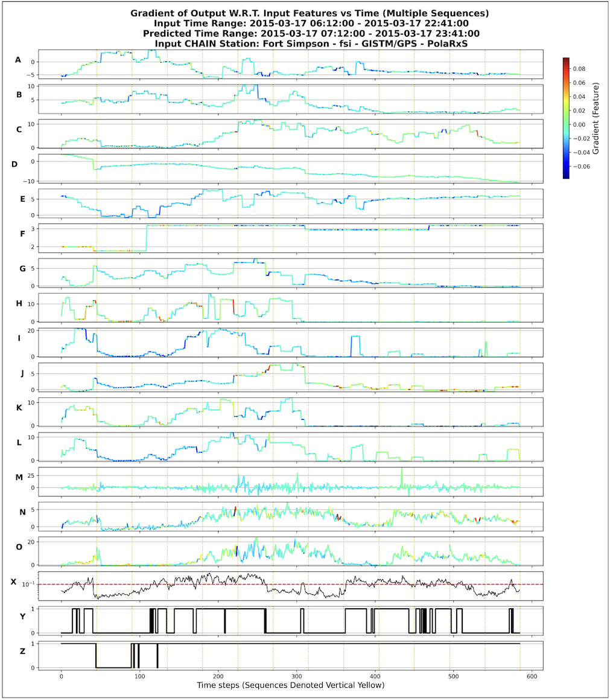
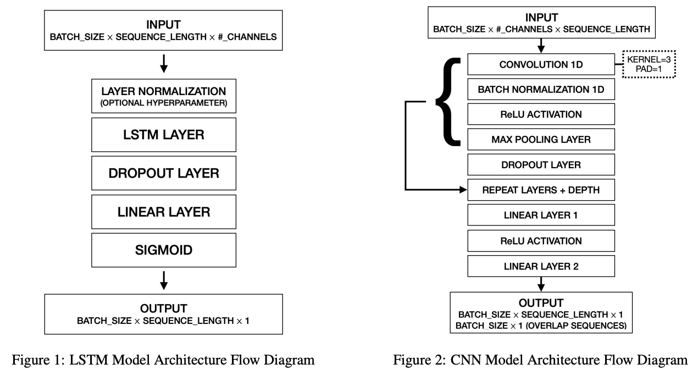
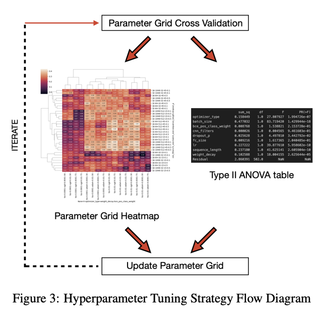
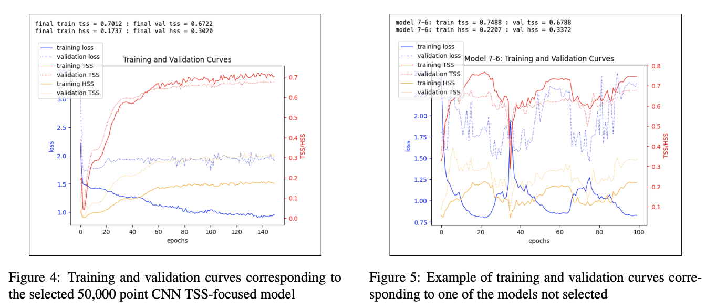

### Predicting High-Latitude GNSS Ionospheric Phase Scintillation using Multivariate Time Series Neural Network Models with Space Weather Indicators

#### Code and Reproducibility Instructions

\

*Multivariate Time Series with Neural Network Gradient Visualizer*

\

*Neural Network Architectures Used*

\

*Hyperparameter Tuning Strategy Flow Diagram*

\

*Example Training and Validation Curves*

\
This is an instructional overview of how to use the code provided to
reproduce the results of the paper.\
\
NOTE: Even though all seeds are reset at the beginning of each script to
ensure reproducibility, results may vary when computed using different
devices/CPUs/GPUs\
\
The devices used in this paper were accessed via Georgia Tech
Instructional Cluster Environment (ICE) with Partnership for an Advanced
Computing Environment (PACE). The specs for the Jupyter servers launched
were as follows:\
Python Environment: Pillow 10.2.0 + scikit-learn 1.4.0 + PyTorch 2.1.0\
Jupyter Notebook Interface\
Node Type: NVIDIA GPU H200 HGX\
Nodes: 1\
Cores (CPUs) Per Node: 16\
GPUs Per Node: 1\
Memory Per Core (GB): 16\
Number of hours: 15\
\
All notebooks attached will be automatically configured to run
regardless if CUDA is available\
\
This following set of instructions is for the 50,000 point CNN model
with non-overlapping sequences:\

1.  Run *1_cnn_ts_hypertune.ipynb*. The 10 iterations of the parameter
    grid in this script were developed through the hyperparameter tuning
    strategy described in section 2.2 of the paper.

    - Each iteration generates a file with the format
      “1_cnn_ts_hypertune_grid_output_1.csv”, where the last digit is
      the iteration number

<!-- -->

1.  Run *1_vis2_cnn_ts_hypertune_grid_strategic.ipynb* - this script
    creates a ranked list, a heatmap, and an ANOVA table for each file,
    and with respect to both TSS and HSS.

    - At the end of all iterations, the script combines all of the files
      and creates total ranked lists of the best models in terms of TSS,
      HSS, and TSS+HSS. The output is a .csv of the top 20 models (for
      TSS, HSS, or TSS+HSS) with format
      “2_cnn_ts_tss_top20_tunedModels.csv”

<!-- -->

1.  Run *1_cnn_ts_hypertune_tss_stage2.ipynb*, which takes the output of
    the previous step and trains the top 20 models across various
    numbers of epochs, and various types of learning rate schedulers.
    The final model is chosen from by evaluating the shapes of the
    curves in the plots

2.  Run *1_cnn_ts_test_full.ipynb* on the chosen model. This script will
    adjust to the parameters entered at the beginning, including
    scheduler and tss/hss. These are the final results.

\
The steps above are similar for TSS, HSS, and TSS+HSS. Step 1 will be
approached differently based on if the current iteration concerns TSS,
HSS, or both. Step 3 will have a different name for the notebook. Step 4
can accommodate either of the 3 metrics if the parameters are entered
correctly.\
\
There are 4 models. The 50,000 point CNN and LSTM with non-overlapping
sequences, the 500,000 point CNN with non-overlapping sequences, and the
50,000 point CNN with overlapping sequences. The above steps can be
followed for each of these 4 models, and for all 3 metrics per model
(TSS, HSS, TSS+HSS), by choosing the notebooks/files with the correct
corresponding names (500,000 point model notebooks/files will have “big”
somewhere in the filename, and the overlapping sequence model will have
“overlap” in the filename, as well as a lack of “1\_” and “2\_”
prefixes) from the “storage” folder.\
\
hypertune -\> stage2 -\> test\
\
The code for visualizing the gradient of the output with respect to the
input features is configured for the 50,000 point CNN TSS-focused model,
and can be accessed by running *1_cnn_ts_test_full_visual_2.ipynb*.
